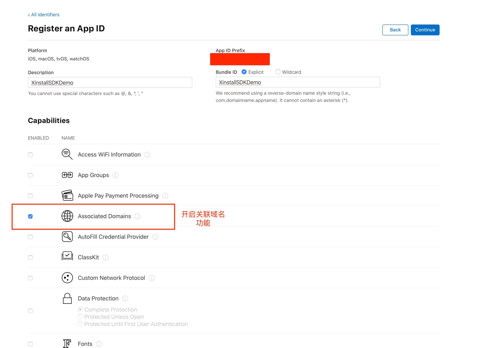
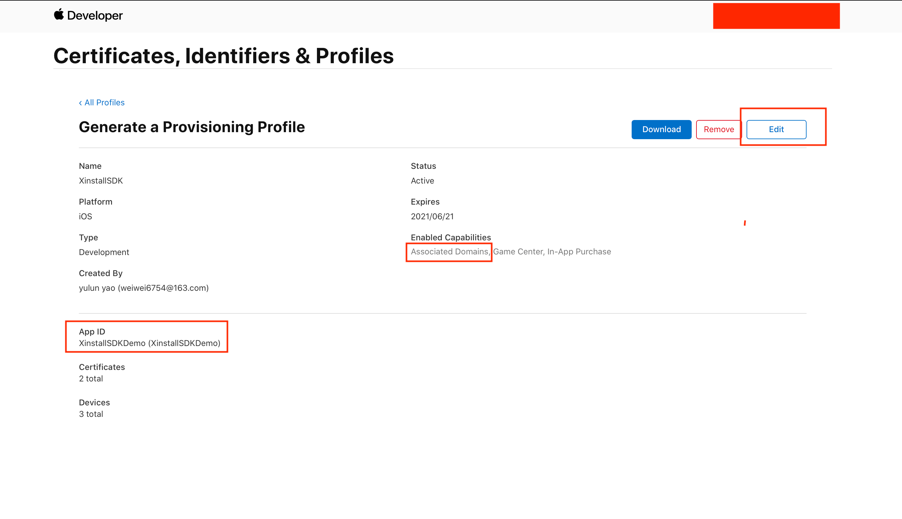

# cordova-plugin-xinstall

> Xinstall 为了方便Cordova开发同学接入SDK的封装SDK

## 前期准备

1. 在Xinstall官网注册自己的账号
2. 创建应用，获得需要使用的appKey 和 scheme

【注】scheme 只有android 使用到，iOS使用的是universal link

## 安装插件

执行下列命令安装并配置`xinstall`插件

```
cordova plugin add cordova-plugin-xinstall --variable XINSTALL_APPKEY={AppKey} --variable XINSTALL_SCHEME={Scheme}
```

## 客户端配置

### 1. Android

Android 不需要任何配置

### 2. iOS

在xxx-Info.plist 文件中需要添加

```xml
<key>com.xinstall.APP_KEY</key>
<string>{appKey}</string>
```

## 调用API

### 1. 快速下载

如果只需要快速下载功能，无需其它功能（携带参数安装、渠道统计、一键拉起），完成初始化即可(这里指安装插件)

### 2.初始化SDK

```js
window.xinstall.init();
```

### 3. 一键拉起

#### 拉起参数获取

调用以下代码注册拉起回调，应尽早调用。如在 `deviceready` 事件回调之时注册

```js
window.xinstall.registerWakeUpHandler(function(data) {
       // 对data进行处理
}, function(msg){
       console.log("xinstall.wakeup error : " + msg)
});
```

**iOS 由于使用Universal Link 技术**

首先，我们需要到[苹果开发者网站](https://developer.apple.com/)，为当前的 App ID 开启关联域名 (Associated Domains) 服务：



为刚才开发关联域名功能的 App ID 创建新的（或更新现有的）描述文件，下载并导入到Xcode中(通过xcode自动生成的描述文件，可跳过这一步)：



在Xcode中配置Xinstall为当前应用生成的关联域名 (Associated Domains) ：**applinks:xxxx.xinstall.top** 和 **applinks:xxxx.xinstall.net**

> 具体的关联域名可在 Xinstall管理后台 - 对应的应用控制台 - iOS下载配置 页面中找到


### 4. 携带参数安装

```js
window.xinstall.getInstallParams(function(data) {
        //对安装data进行处理
}, function(msg){
        console.log('xinstall.getInstall error: ' + msg);
}, 15);
```

【注】过期时间只有androidSDK 提供，后期肯能会去除。

成功回调的data数据为

```json
{"channelCode":"渠道号","timeSpan":"获取数据间隔时间","data":{"uo":"{\"testkey\":\"1111\"}","co":""},"isFirstFetch":true}
// uo 为页面参事
// co 为点击参数
// isFirstFetch 是否第一次获取安装参数
```

### 5. 渠道统计相关

#### 5.1 注册量统计

```js
window.xinstall.reportRegister();
```

#### 5.2 渠道效果统计

```js
window.xinstall.reportEffectEvent(eventId, eventVal);
```

**补充说明**

只有 Xinstall 后台创建事件统计，并且代码中 **传递的事件ID** 与 **后台创建的ID** 一致时，上报数据才会被统计。

### 6. 广告平台渠道功能

> 如果您在 Xinstall 管理后台对应 App 中，**只使用「自建渠道」，而不使用「广告平台渠道」，则无需进行本小节中额外的集成工作**，也能正常使用 Xinstall 提供的其他功能。
>
> 注意：根据目前已有的各大主流广告平台的统计方式，目前 iOS 端和 Android 端均需要用户授权并获取一些设备关键值后才能正常进行 [ 广告平台渠道 ] 的统计，如 IDFA / OAID / GAID 等，对该行为敏感的 App 请慎重使用该功能。

#### 6.1 配置工作

**iOS 端：**

在 Xcode 中打开 iOS 端的工程，在 `Info.plist` 文件中配置一个权限作用声明（如果不配置将导致 App 启动后马上闪退）：

```xml
<key>NSUserTrackingUsageDescription</key>
<string>这里是针对获取 IDFA 的作用描述，请根据实际情况填写</string>
```

在 Xcode 中，找到 App 对应的「Target」，再点击「General」，然后在「Frameworks, Libraries, and Embedded Content」中，添加如下两个框架：

* AppTrackingTransparency.framework
* AdSupport.framework

**Android 端：**

  相关接入可以参考广告平台联调指南中的[《Android集成指南》](https://doc.xinstall.com/AD/AndroidGuide.html)

1. 接入IMEI需要额外的全下申请，需要在`AndroidManifest`中添加权限声明

   ```java
   <uses-permission android:name="android.permission.READ_PHONE_STATE"/>
   ```

2. 如果使用OAID，因为内部使用反射获取oaid 参数，所以都需要外部用户接入OAID SDK 。具体接入参考[《Android集成指南》](https://doc.xinstall.com/AD/AndroidGuide.html)


##### 6.2、更换初始化方法

**使用新的 initWithAd 方法，替代原先的 init 方法来进行模块的初始化**

> iOS 端使用该方法时，需要传入 IDFA（在 JS 脚本内）。您可以使用任意方式在 JS 脚本中获取到 IDFA，例如第三方获取 IDFA 的模块。
>

**入参说明**：需要主动传入参数，字典

入参内部字段：

* iOS 端：

  <table>
         <tr>
             <th>参数名</th>
             <th>参数类型</th>
             <th>描述 </th>
         </tr>
         <tr>
             <th>idfa</th>
             <th>字符串</th>
             <th>iOS 系统中的广告标识符</th>
         </tr>
     </table>


* Android 端：

  <table>
            <tr>
                <th>参数名</th>
                <th>参数类型</th>
                <th>描述 </th>
            </tr>
            <tr>
                <th>adEnabled</th>
                <th>boolean</th>
                <th>是否使用广告功能</th>
            </tr>
    				<tr>
                <th>oaid （可选）</th>
                <th>string</th>
                <th>OAID</th>
            </tr>
    				<tr>
                <th>gaid（可选）</th>
                <th>string</th>
                <th>GaID(google Ad ID)</th>
            </tr>
        </table>

**调用示例**

```javascript

  // oaid和gaid 为选传，不传则代表使用SDK自动去获取（SDK内不包括OAID SDK，需要自己接入）
  xinstall.initWithAd({adEnabled:true,idfa:"idfa需要自己传入",oaid:"oaid测试",gaid:"测试"});
  // 如果希望在完成初始化，立即执行之后的步骤可以通过 下列代码实现-------------------------
  //window.xinstall.initWithAd({adEnable:true,idfa:"外部获取的idfa"},function() {
	//		window.xinstall.getInstallParams 或者 window.xinstall.registerWakeUpHandler 等操作
	//});
  //-----------------------------------------------------------------------------

```

##### 5.3、上架须知

**在使用了广告平台渠道后，若您的 App 需要上架，请认真阅读本段内容。**

##### 5.3.1 iOS 端：上架 App Store

1. 如果您的 App 没有接入苹果广告（即在 App 中显示苹果投放的广告），那么在提交审核时，在广告标识符中，请按照下图勾选：


1. 在 App Store Connect 对应 App —「App隐私」—「数据类型」选项中，需要选择：**“是，我们会从此 App 中收集数据”**：


在下一步中，勾选「设备 ID」并点击【发布】按钮：


点击【设置设备 ID】按钮后，在弹出的弹框中，根据实际情况进行勾选：

- 如果您仅仅是接入了 Xinstall 广告平台而使用了 IDFA，那么只需要勾选：**第三方广告**
- 如果您在接入 Xinstall 广告平台之外，还自行使用 IDFA 进行别的用途，那么在勾选 **第三方广告** 后，还需要您根据您的实际使用情况，进行其他选项的勾选


勾选完成后点击【下一步】按钮，在 **“从此 App 中收集的设备 ID 是否与用户身份关联？”** 选项中，请根据如下情况进行选择：

- 如果您仅仅是接入了 Xinstall 广告平台而使用了 IDFA，那么选择 **“否，从此 App 中收集的设备 ID 未与用户身份关联”**
- 如果您在接入 Xinstall 广告平台之外，还自行使用 IDFA 进行别的用途，那么请根据您的实际情况选择对应的选项


最后，在弹出的弹框中，选择 **“是，我们会将设备 ID 用于追踪目的”**，并点击【发布】按钮：


##### 5.3.2 Android 端

无特殊需要注意，如碰上相关合规问题，参考 [《应用合规指南》](


## 导出apk/ipa包并上传

参考官网文档

[iOS集成-导出ipa包并上传](https://doc.xinstall.com/integrationGuide/iOSIntegrationGuide.html#四、导出ipa包并上传)

[Android-集成](https://doc.xinstall.com/integrationGuide/AndroidIntegrationGuide.html#四、导出apk包并上传)

## 如何测试功能

参考官方文档 [测试集成效果](https://doc.xinstall.com/integrationGuide/comfirm.html)

## 更多 Xinstall 进阶功能

若您想要自定义下载页面，或者查看数据报表等进阶功能，请移步 [Xinstall 官网](https://xinstall.com) 查看对应文档。

若您在集成过程中如有任何疑问或者困难，可以随时[联系 Xinstall 官方客服](https://wpa1.qq.com/qsw1OZaM?_type=wpa&qidian=true) 在线解决。